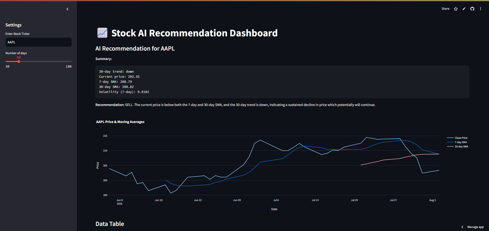

[Live Demo](https://stock-ai-recommendation.streamlit.app/)
# Stock AI Recommendation Tool

An end-to-end project that pulls real-time/historical stock data from [Polygon.io](https://polygon.io/), processes and analyzes it, and generates buy/sell/hold recommendations using OpenAI's GPT API.

[](https://www.python.org/)
[](https://stock-ai-recommendation.streamlit.app)
[](https://opensource.org/license/mit)
## Features
- Fetch real-time & historical stock data
- Clean & engineer financial indicators (SMA, volatility, etc.)
- AI-driven stock recommendations with rationale
- Interactive dashboard (Streamlit)
- Exportable reports (CSV/JSON)

---

## Tech Stack
- **Python**: pandas, requests, plotly
- **APIs**: Polygon.io, OpenAI GPT
- **Framework**: Streamlit
- **Deployment**: Streamlit Cloud

---

## Setup

1. **Clone the repo**
```bash
git clone https://github.com/YOURUSERNAME/stock-ai-recommendation.git
cd stock-ai-recommendation
```
2. **Instal Dependencies**
```bash
python -m venv venv
source venv/bin/activate   # Windows: venv\Scripts\activate
pip install -r requirements.txt
```
**3. Add API keys (Create a .env file in the project root:)**
```bash
POLYGON_API_KEY=your_polygon_api_key_here
OPENAI_API_KEY=your_openai_api_key_here
```
**4. Run app**
```bash
streamlit run src/app.py
```

---

### **2. Future Improvements Section**
Shows growth mindset:

```markdown
## Future Improvements
- Add multi-stock comparison
- Integrate news sentiment analysis
- Backtest strategies on historical data
- Deploy on custom domain with CI/CD
```
